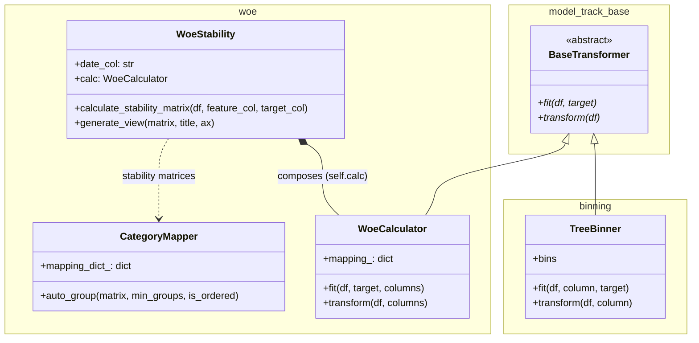

# Model Track CR

*Read this in other languages: [English](README.md), [Português](README.pt-br.md)*

**model-track-cr** is a Python library designed to **structure, standardize, and operationalize the full statistical and machine learning modeling workflow**, with a strong focus on **credit, risk, and supervised modeling use cases**.

Rather than offering isolated utilities, the library provides a **cohesive set of tools** that cover the most critical stages of real-world modeling:

- variable diagnostics and exploration
- binning and categorization
- Weight of Evidence (WOE) and Information Value (IV)
- temporal stability analysis
- foundations for post-model monitoring

All components are designed to work together, with explicit APIs, reproducibility in mind, and strong test coverage.

---

## 🎯 Project Philosophy

The **model-track-cr** project was created to address a common problem in applied modeling:

> *modeling workflows are often fragmented across notebooks, ad-hoc scripts, and hard-to-reproduce logic.*

This library is built around the following principles:

- **Workflow-first**: tools make sense primarily when used together
- **Pandas-first**: native integration with DataFrames
- **Clear responsibilities**: each module has a well-defined scope
- **Reproducibility**: modeling decisions are explicit and traceable
- **Technical governance**: stability and monitoring are first-class concerns
- **Strict TDD**: tests act as living documentation

---

## 🧭 High-Level Modeling Workflow

A typical modeling flow using this library follows these steps:

1. **Initial data diagnostics**
2. **Binning / categorization**
3. **WOE and IV computation**
4. **Temporal stability analysis**
5. **Post-model monitoring support**

Each step is supported by a dedicated module that integrates naturally with the others.


---

## 🏗️ Project Architecture

`model-track-cr` is organized in **pandas-first** modules. Several classes inherit from `BaseTransformer` and expose `fit` / `transform`, but method signatures are **DataFrame-oriented** (for example, explicit column names and optional `columns` lists). That keeps the API explicit for modeling work; if you need a strict **scikit-learn `Pipeline`**, plan for thin wrapper steps that adapt arguments and return types.



### Key components

* **BaseTransformer**: Abstract `fit` / `transform` / `fit_transform` contract shared across several transformers.
* **TreeBinner**: Supervised binning via `sklearn.tree.DecisionTreeClassifier` split thresholds.
* **WoeCalculator**: WoE mappings with Laplace smoothing; `fit` / `transform` operate on one or more categorical columns.
* **WoeStability** (`model_track.woe`): Per-period WoE matrices and plotting helpers; composes a `WoeCalculator`.
* **CategoryMapper** (`model_track.woe`): Grouping suggestions over stability matrices (inversions / SSE cost).
* **ProjectContext** (`model_track`): Serializable bag for bins, WoE maps, selected features, and free-form metadata (intended to grow with the library).

---


## 🧩 Core Modules Overview

### 📊 1. Diagnostics and early statistics (`preprocessing`, `stats`)

Use **`preprocessing`** for table-level audits and summaries, and **`stats`** for IV / association style metrics and selection helpers.

Example (variable audit summary):

```python
from model_track.preprocessing import DataAuditor

auditor = DataAuditor(target="target")
summary = auditor.get_summary(df)
```

Example (IV-driven feature screening lives under `stats`):

```python
from model_track.stats import StatisticalSelector

selector = StatisticalSelector()
selector.fit(df, target="target", features=["feat_a", "feat_b"])
df_selected = selector.transform(df)
```

This step typically informs:
-	which variables to bin
-	how to handle missing values
-	potential stability risks

---

### 🪜 2. Binning & categorization (`binning`)

Responsible for turning continuous inputs into ordered categories for WoE and stability workflows.

**Currently exported:** supervised **tree-based** binning (`TreeBinner`). Quantile binning and a dedicated “bin applier” helper are **not** in the package yet; they are listed under [Technical roadmap](#technical-roadmap).

Example:

```python
from model_track.binning import TreeBinner

binner = TreeBinner(max_depth=2)
binner.fit(df, column="income", target="target")
df["income_cat"] = binner.transform(df, column="income")
```

---

### 🧮 3. WoE and IV (`woe`, `stats`)

Implements classic supervised modeling metrics:

- WoE mappings and transformed columns via `WoeCalculator`
- IV and related helpers via `model_track.stats` (for example `compute_iv`)
- Per-period WoE paths via `WoeStability` (see section 4)

Example:

```python
from model_track.woe import WoeCalculator

calc = WoeCalculator()
calc.fit(df, target="target", columns=["income_cat"])
df_woe = calc.transform(df, columns=["income_cat"])
```

These outputs are typically used for:
-	feature selection
-	model interpretability
-	direct input into linear models

---

### 📈 4. Temporal WoE stability (`model_track.woe`)

Tools to assess whether category-level WoE stays consistent over time (e.g. by vintage or calendar period).

Example:

```python
from model_track.woe import WoeStability

ws = WoeStability(date_col="period")
matrix = ws.calculate_stability_matrix(
    df=df,
    feature_col="income_cat",
    target_col="target",
)
ws.generate_view(matrix, title="Income_cat WoE stability")
```

This stage is essential for:
-	validating model robustness
-	supporting production decisions
-	monitoring deployed models

---

## 🚀 Installation

> Install in user mode:
```bash
pip install model-track-cr

# Or with heavy ML dependencies (LightGBM, etc.):
pip install "model-track-cr[tuning]"
```
The lib is available on https://pypi.org/project/model-track-cr/


> Install in development mode:

```bash
git clone https://github.com/Cristiano2132/model-track-cr.git
cd model-track-cr

pip install -e .

# Or using Poetry:
poetry install
```
---

## 🧪 Testing and code quality

Run tests: `make test`

Run tests with coverage: `make cov`

HTML coverage report: `htmlcov/index.html`

The project follows strict Test-Driven Development (TDD) and is backed by a robust **Testing Pyramid Strategy**. Every new feature must be accompanied by automated tests.

For testing tiers (unit, statistical, integration, benchmarks), see the [Testing Strategy Guide](documentation/TESTING_STRATEGY.md). Contributor environment notes live in [`AGENTS.md`](AGENTS.md).

---

## Workflow and contributions

This project uses Git Flow, GitHub Issues, and Pull Requests. Day-to-day commands, CI expectations, and local setup are summarized in [`AGENTS.md`](AGENTS.md).

---

## Documentation in this repository

Right now, the main narrative lives in this README (EN / PT-BR) plus the testing strategy linked above. Docstrings in `src/model_track` are the API reference. Deeper per-module guides and an end-to-end modeling walkthrough can be added as the surface area grows.

---

## When should you use this library?

This project is a good fit if you want to:
-	standardize modeling workflows across teams
-	move from fragile notebooks to reproducible pipelines
-	evaluate stability before and after deployment
-	improve technical governance of models
-	document modeling decisions clearly

---

## Technical roadmap

- Quantile-based binning and helpers to apply saved bins consistently across tables
- Automated PSI and additional drift metrics
- Feature selection informed by stability matrices
- Clearer optional adapters for scikit-learn `Pipeline` users
- Richer monitoring and visualization utilities

---

## License

MIT

