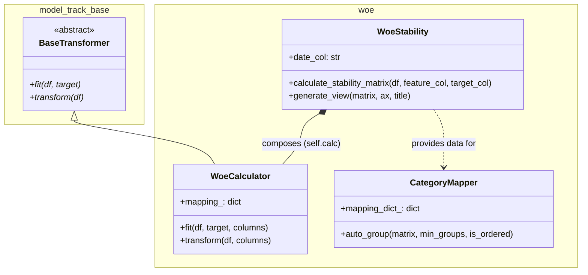

# Model Track CR

**model-track-cr** is a Python library designed to **structure, standardize, and operationalize the full statistical and machine learning modeling workflow**, with a strong focus on **credit, risk, and supervised modeling use cases**.

Rather than offering isolated utilities, the library provides a **cohesive set of tools** that cover the most critical stages of real-world modeling:

- variable diagnostics and exploration
- binning and categorization
- Weight of Evidence (WOE) and Information Value (IV)
- temporal stability analysis
- foundations for post-model monitoring

All components are designed to work together, with explicit APIs, reproducibility in mind, and strong test coverage.

---

## 🎯 Project Philosophy

The **model-track-cr** project was created to address a common problem in applied modeling:

> *modeling workflows are often fragmented across notebooks, ad-hoc scripts, and hard-to-reproduce logic.*

This library is built around the following principles:

- **Workflow-first**: tools make sense primarily when used together
- **Pandas-first**: native integration with DataFrames
- **Clear responsibilities**: each module has a well-defined scope
- **Reproducibility**: modeling decisions are explicit and traceable
- **Technical governance**: stability and monitoring are first-class concerns
- **Strict TDD**: tests act as living documentation

---

## 🧭 High-Level Modeling Workflow

A typical modeling flow using this library follows these steps:

1. **Initial data diagnostics**
2. **Binning / categorization**
3. **WOE and IV computation**
4. **Temporal stability analysis**
5. **Post-model monitoring support**

Each step is supported by a dedicated module that integrates naturally with the others.

Perfect! Since you are working on a professional toolkit and aiming for a "market standard" documentation, having the **README.md** in English is the right move—especially if you plan to showcase this on GitHub.

Here is the translated and refined section for your documentation. I’ve adjusted the Mermaid labels to English as well to maintain consistency.

---

## 🏗️ Project Architecture

`model-track-cr` follows a modular structure based on transformers compatible with the Scikit-Learn ecosystem. This ensures seamless integration into standard data science pipelines.



### Key Components

* **BaseTransformer**: An abstract base class that enforces the `fit`/`transform` contract, ensuring compatibility with Scikit-Learn pipelines.
* **WoeCalculator**: Handles the Weight of Evidence (WoE) logic with Laplace Smoothing, essential for credit risk scorecards.
* **WoeStability**: Orchestrates temporal stability analysis, generating WoE matrices across different time periods (safiras).
* **CategoryMapper**: An optimized grouping engine that uses exhaustive search to minimize WoE inversions and maintain monotonic risk relationships.

---


## 🧩 Core Modules Overview

### 📊 1. Statistics & Diagnostics (`stats`)

Provides tools for early-stage variable understanding:

- global summaries
- missing value analysis
- basic diagnostics to guide modeling decisions

Example:
```python
from model_track.stats import get_summary

summary = get_summary(df)
````

This step typically informs:
-	which variables to bin
-	how to handle missing values
-	potential stability risks

📘 Detailed documentation is provided in a dedicated module guide.

---

🪜 2. Binning & Categorization (binning)

Responsible for transforming continuous variables into interpretable and stable categories.

Available strategies:
-	tree-based binning (TreeBinner)
-	quantile-based binning (QuantileBinner)
-	consistent application via BinApplier

Example:
```python
from model_track.binning import TreeBinner, BinApplier

binner = TreeBinner(max_depth=2)
binner.fit(df, feature="income", target="target")

applier = BinApplier(df)
df["income_cat"] = applier.apply("income", binner.bins_)
````

📘 Each binning strategy is documented in its own module reference.

---

🧮 3. WOE & IV (woe)

Implements classic supervised modeling metrics:
-	WOE / IV tables
-	reusable WOE mappings
-	per-period analysis

Example:

```python
from model_track.woe import WoeCalculator

woe_table = WoeCalculator.compute_table(
    df=df,
    target_col="target",
    feature_col="income_cat",
    event_value=1,
)
```

These outputs are typically used for:
-	feature selection
-	model interpretability
-	direct input into linear models

📘 Full API and examples are covered in the WOE module documentation.

---

📈 4. Temporal Stability (stability)

Tools to assess whether variable behavior remains consistent over time.

Currently available:
-	WOE stability by period
-	integrated visualizations

Example:

```python
from model_track.stability.woe import WoeStability

ws = WoeStability(df=df, date_col="period")
ws.generate_view(
    feature_col="income_cat",
    target_col="target"
)
```

This stage is essential for:
-	validating model robustness
-	supporting production decisions
-	monitoring deployed models

📘 Stability concepts and metrics are documented in a dedicated guide.


---

🚀 Installation

> Install in user mode:
```bash
pip install model-track-cr
```
The lib is available on https://pypi.org/project/model-track-cr/


> Install in development mode:

```bash
git clone https://github.com/YOUR_USER/model-track-cr.git
cd model-track-cr

pip install -e .

# Or using Poetry:
poetry install
```
---

🧪 Testing & Code Quality

Run tests: `make test`

Run tests with coverage: `make cov`

HTML coverage report: `htmlcov/index.html`

The project follows strict Test-Driven Development (TDD).
Every new feature must be accompanied by tests.

---

🔄 Development Workflow & Project Management

This project uses:
-	Git Flow
-	GitHub Issues
-	GitHub Projects (Board)

The full development workflow — including branch strategy, issue management, pull requests, CI behavior, and versioning — is documented in:

📘 Project Management Guide with GitHub Projects + Git Flow

This document is the official reference for contributors.

---

📚 Documentation Structure

Documentation is organized in three layers:
	1.	Module-level documentation
Each core module (binning, stats, woe, stability, etc.) has its own detailed guide.
	2.	API and technical references
Focused on functions, classes, and parameters.
	3.	End-to-end modeling guide
A complete, real-world example demonstrating how all modules are used together
in a full modeling workflow.

The end-to-end guide is intended to be the final and most integrative document.

---

🧠 When Should You Use This Library?

This project is a good fit if you want to:
-	standardize modeling workflows across teams
-	move from fragile notebooks to reproducible pipelines
-	evaluate stability before and after deployment
-	improve technical governance of models
-	document modeling decisions clearly

---

📍 Technical Roadmap
-	automated PSI computation
-	feature selection based on stability
-	pipeline integrations
-	additional drift metrics
-	improved visualization utilities

---

📝 License

MIT

