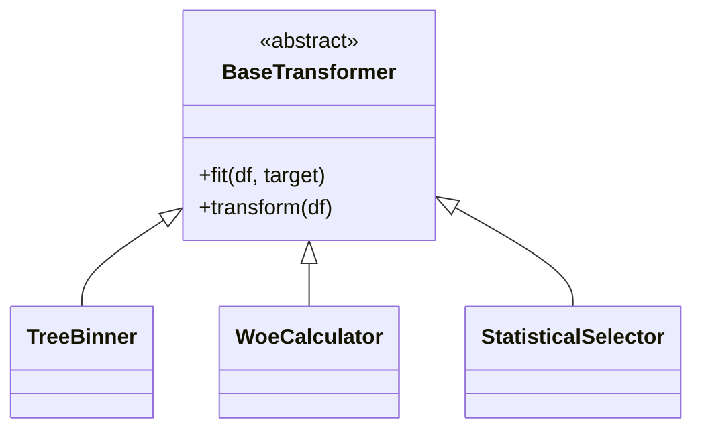

# 🚀 model-track-cr

[](https://pypi.org/project/model-track-cr/)
[](https://pypi.org/project/model-track-cr/)
[](https://opensource.org/licenses/MIT)

*Read this in other languages: [English](README.md), [Português](README.pt-br.md)*

**model-track-cr** is a professional Python toolkit designed to **structure, standardize, and operationalize** the full statistical and machine learning modeling workflow. 

It is purpose-built for **credit, risk, and supervised modeling** (Binary, Multiclass, and Regression). Instead of fragmented notebooks, `model-track-cr` provides cohesive, Pandas-first components that work seamlessly together—from data diagnostic to model deployment.

---

## 📦 Installation

Install via pip:

```bash
pip install model-track-cr
```

For advanced features (like Bayesian Tuning and LightGBM support):
```bash
pip install "model-track-cr[tuning]"
```

---

## ⚡ Quickstart

Here's how easy it is to build a full feature engineering pipeline:

```python
import pandas as pd
from model_track.preprocessing import DataOptimizer
from model_track.binning import TreeBinner
from model_track.woe import WoeCalculator
from model_track.stats import StatisticalSelector

# 1. Optimize memory
df = DataOptimizer.reduce_mem_usage(df)

# 2. Supervised Binning
binner = TreeBinner(max_depth=3)
binner.fit(df, column="feature", target="target")
df["feature_binned"] = binner.transform(df, column="feature")

# 3. Weight of Evidence (WoE) Transformation
woe_calc = WoeCalculator()
woe_calc.fit(df, target="target", columns=["feature_binned"])
df_woe = woe_calc.transform(df, columns=["feature_binned"])

# 4. Feature Selection (Information Value & Cramer's V)
selector = StatisticalSelector(iv_threshold=0.02)
selector.fit(df_woe, target="target", features=["feature_binned"])
df_selected = selector.transform(df_woe)
```

---

## 🛠️ Core Capabilities

- **📊 Diagnostics & Optimization**: Memory reduction (`DataOptimizer`), missing value auditing (`DataAuditor`), and data schema extraction.
- **🪜 Binning**: Supervised (`TreeBinner`) and Unsupervised (`QuantileBinner`) binning strategies.
- **🧮 WoE & IV**: Weight of Evidence calculators (`WoeCalculator`) and Information Value adapters for Binary, Multiclass, and Regression tasks.
- **🎯 Feature Selection**: Automated selection using IV, Variance, Spearman correlation, and Cramer's V (`StatisticalSelector`, `RegressionSelector`, `MulticlassSelector`).
- **📈 Stability Monitoring**: Population Stability Index (PSI) and Temporal WoE stability matrices (`WoeStability`) to track data drift.
- **🧠 Hyperparameter Tuning**: Model-agnostic Bayesian optimization with built-in LightGBM presets (`BayesianTuner`, `LGBMTuner`).
- **📏 Evaluation**: Standardized metrics and reports for all task types.
- **💾 Project Context**: Serialize your entire pipeline (bins, WoE maps, metadata) for production deployment (`ProjectContext`).

---

## 📓 Example Notebooks

Want to see it in action? Check out our end-to-end examples:

- [Multiclass Pipeline (Wine Dataset)](notebooks/multiclass_example.ipynb): Binning → `MulticlassSelector` → `OvRWoeAdapter` → LightGBM → Evaluation.
- [Regression Pipeline (California Housing)](notebooks/regression_example.ipynb): Audit → `RegressionSelector` → LightGBM → Stability Report.

---

## 🧩 Architecture & Philosophy

The library is built around a **Pandas-first** philosophy, where every component follows a `fit`/`transform` interface but expects and returns Pandas DataFrames. This ensures metadata (like column names) is preserved throughout the pipeline.


```mermaid
classDiagram
    BaseTransformer <|-- TreeBinner
    BaseTransformer <|-- WoeCalculator
    BaseTransformer <|-- StatisticalSelector
    
    class BaseTransformer {
        <<abstract>>
        +fit(df, target)
        +transform(df)
    }
```

## 🤝 Contributing
The project follows strict **Test-Driven Development (TDD)** with 100% coverage. 
See [`CONTRIBUTING.md`](CONTRIBUTING.md) and [`AGENTS.md`](AGENTS.md) for local setup and Gitflow guidelines.

## 📄 License
MIT License
