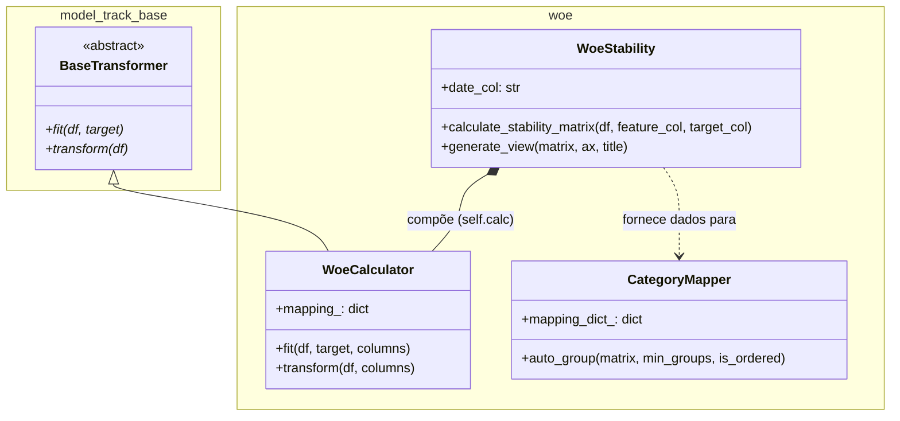

# Model Track CR

*Leia isso em outros idiomas: [English](README.md), [Português](README.pt-br.md)*

**model-track-cr** é uma biblioteca Python projetada para **estruturar, padronizar e operacionalizar todo o fluxo de modelagem estatística e machine learning**, com forte foco em casos de uso de **crédito, risco e modelagem supervisionada**.

Em vez de oferecer utilitários isolados, a biblioteca fornece um **conjunto coeso de ferramentas** que cobrem os estágios mais críticos da modelagem no mundo real:

- diagnóstico e exploração de variáveis
- agrupamento (binning) e categorização
- Weight of Evidence (WOE) e Information Value (IV)
- análise de estabilidade temporal
- bases para monitoramento pós-implantação

Todos os componentes são projetados para trabalhar juntos, com APIs explícitas, foco em reprodutibilidade e forte cobertura de testes.

---

## 🎯 Filosofia do Projeto

O projeto **model-track-cr** foi criado para resolver um problema comum em modelagem aplicada:

> *fluxos de modelagem geralmente são fragmentados entre notebooks, scripts ad-hoc e lógicas difíceis de reproduzir.*

Esta biblioteca é construída com base nos seguintes princípios:

- **Foco em Workflow**: ferramentas fazem sentido primariamente quando usadas em conjunto
- **Foco no Pandas**: integração nativa com DataFrames
- **Responsabilidades claras**: cada módulo tem um escopo bem definido
- **Reprodutibilidade**: decisões de modelagem são explícitas e rastreáveis
- **Governança técnica**: estabilidade e monitoramento são preocupações de primeira classe
- **TDD Estrito**: testes atuam como documentação viva

---

## 🧭 Fluxo de Modelagem de Alto Nível

Um fluxo típico de modelagem usando esta biblioteca segue estas etapas:

1. **Diagnóstico inicial de dados**
2. **Agrupamento / categorização (Binning)**
3. **Cálculo de WOE e IV**
4. **Análise de estabilidade temporal**
5. **Suporte a monitoramento pós-implantação**

Cada etapa é suportada por um módulo dedicado que se integra naturalmente com os demais.

---

## 🏗️ Arquitetura do Projeto

O `model-track-cr` segue uma estrutura modular baseada em transformadores compatíveis com o ecossistema Scikit-Learn. Isso garante uma integração perfeita em pipelines padrão de ciência de dados.



### Componentes Principais

* **BaseTransformer**: Classe base abstrata que impõe o contrato `fit`/`transform`, garantindo compatibilidade com pipelines Scikit-Learn.
* **WoeCalculator**: Lida com a lógica de Weight of Evidence (WoE) utilizando Laplace Smoothing, essencial para scorecards de risco de crédito.
* **WoeStability**: Orquestra a análise de estabilidade temporal, gerando matrizes de WoE em diferentes períodos de tempo (safras).
* **CategoryMapper**: Um motor otimizado de agrupamento que usa busca exaustiva para minimizar inversões de WoE e manter relações de risco monotônicas.

---

## 🧩 Visão Geral dos Módulos Core

### 📊 1. Estatísticas & Diagnósticos (`stats`)

Fornece ferramentas para compreensão de variáveis em estágio inicial:

- resumos globais
- análise de valores ausentes
- diagnósticos básicos para orientar decisões de modelagem

Exemplo:
```python
from model_track.stats import get_summary

summary = get_summary(df)
```

Este passo geralmente informa:
- quais variáveis devem ser agrupadas (binned)
- como tratar valores ausentes
- potenciais riscos de estabilidade

📘 Documentação detalhada é fornecida em um guia de módulo dedicado.

---

### 🪜 2. Binning & Categorização (`binning`)

Responsável por transformar variáveis contínuas em categorias estáveis e interpretáveis.

Estratégias disponíveis:
- agrupamento baseado em árvores (`TreeBinner`)
- agrupamento baseado em quantis (`QuantileBinner`)
- aplicação consistente via `BinApplier`

Exemplo:
```python
from model_track.binning import TreeBinner, BinApplier

binner = TreeBinner(max_depth=2)
binner.fit(df, feature="income", target="target")

applier = BinApplier(df)
df["income_cat"] = applier.apply("income", binner.bins_)
```

📘 Cada estratégia de binning está documentada em sua própria referência de módulo.

---

### 🧮 3. WOE & IV (`woe`)

Implementa métricas clássicas de modelagem supervisionada:
- tabelas WOE / IV
- mapeamentos WOE reutilizáveis
- análise por período

Exemplo:

```python
from model_track.woe import WoeCalculator

woe_table = WoeCalculator.compute_table(
    df=df,
    target_col="target",
    feature_col="income_cat",
    event_value=1,
)
```

Essas saídas geralmente são usadas para:
- seleção de variáveis
- interpretabilidade de modelo
- entrada direta para modelos lineares

📘 A API completa e exemplos estão cobertos na documentação do módulo WOE.

---

### 📈 4. Estabilidade Temporal (`stability`)

Ferramentas para avaliar se o comportamento de uma variável permanece consistente ao longo do tempo.

Atualmente disponíveis:
- estabilidade de WOE por período
- visualizações integradas

Exemplo:

```python
from model_track.stability.woe import WoeStability

ws = WoeStability(df=df, date_col="period")
ws.generate_view(
    feature_col="income_cat",
    target_col="target"
)
```

Esta etapa é essencial para:
- validar a robustez do modelo
- apoiar decisões de produção
- monitorar modelos implantados

📘 Os conceitos e métricas de estabilidade estão documentados em um guia dedicado.

---

## 🚀 Instalação

> Instalar no modo usuário:
```bash
pip install model-track-cr
```
A biblioteca está disponível no PyPI: https://pypi.org/project/model-track-cr/

> Instalar no modo desenvolvimento:

```bash
git clone https://github.com/YOUR_USER/model-track-cr.git
cd model-track-cr

pip install -e .

# Ou usando Poetry:
poetry install
```

---

## 🧪 Qualidade de Código & Testes

Rodar testes: `make test`

Rodar testes com coverage: `make cov`

Relatório de coverage HTML: `htmlcov/index.html`

O projeto segue um rigoroso Test-Driven Development (TDD) e é apoiado por uma robusta **Estratégia de Pirâmide de Testes**. Toda nova funcionalidade deve ser acompanhada de testes automatizados.

📘 Para uma análise detalhada dos nossos níveis de teste (Unitário, Componente, Integração, API/E2E), consulte o [Guia de Estratégia de Testes](documentation/TESTING_STRATEGY.pt-br.md).

---

## 🔄 Fluxo de Desenvolvimento & Gestão de Projetos

Este projeto usa:
- Git Flow
- GitHub Issues
- GitHub Projects (Board)

Todo o fluxo de desenvolvimento — incluindo estratégia de branch, gestão de issues, pull requests, comportamento de CI e versionamento — está documentado em:

📘 Guia de Gestão de Projetos com GitHub Projects + Git Flow

Este documento é a referência oficial para contribuidores.

---

## 📚 Estrutura da Documentação

A documentação é organizada em três camadas:
1. **Documentação a nível de módulo**
   Cada módulo core (binning, stats, woe, stability, etc.) possui seu próprio guia detalhado.
2. **API e referências técnicas**
   Focado em funções, classes e parâmetros.
3. **Guia de modelagem ponta-a-ponta (End-to-End)**
   Um exemplo real e completo demonstrando como todos os módulos são utilizados em conjunto em um fluxo integral de modelagem.

O guia end-to-end tem como objetivo ser o documento final e mais integrativo.

---

## 🧠 Quando você deve usar esta biblioteca?

Este projeto é uma ótima escolha se você deseja:
- padronizar fluxos de modelagem entre equipes
- migrar de notebooks frágeis para pipelines reprodutíveis
- avaliar a estabilidade antes e depois da implantação
- melhorar a governança técnica dos modelos
- documentar claramente as decisões de modelagem

---

## 📍 Roadmap Técnico
- cálculo automatizado de PSI
- seleção de features baseada em estabilidade
- integrações de pipeline
- métricas adicionais de drift
- utilitários de visualização aprimorados

---

## 📝 Licença

MIT
