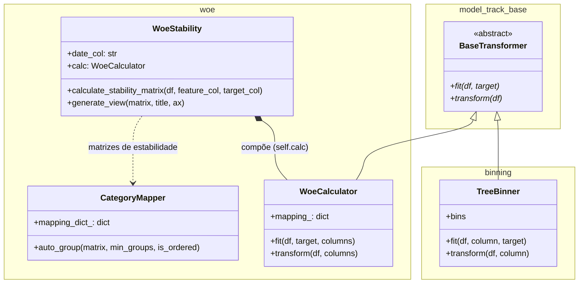

# Model Track CR

*Leia isso em outros idiomas: [English](README.md), [Português](README.pt-br.md)*

**model-track-cr** é uma biblioteca Python projetada para **estruturar, padronizar e operacionalizar todo o fluxo de modelagem estatística e machine learning**, com forte foco em casos de uso de **crédito, risco e modelagem supervisionada**.

Em vez de oferecer utilitários isolados, a biblioteca fornece um **conjunto coeso de ferramentas** que cobrem os estágios mais críticos da modelagem no mundo real:

- diagnóstico e exploração de variáveis
- agrupamento (binning) e categorização
- Weight of Evidence (WOE) e Information Value (IV)
- análise de estabilidade temporal
- bases para monitoramento pós-implantação

Todos os componentes são projetados para trabalhar juntos, com APIs explícitas, foco em reprodutibilidade e forte cobertura de testes.

---

## 🎯 Filosofia do Projeto

O projeto **model-track-cr** foi criado para resolver um problema comum em modelagem aplicada:

> *fluxos de modelagem geralmente são fragmentados entre notebooks, scripts ad-hoc e lógicas difíceis de reproduzir.*

Esta biblioteca é construída com base nos seguintes princípios:

- **Foco em Workflow**: ferramentas fazem sentido primariamente quando usadas em conjunto
- **Foco no Pandas**: integração nativa com DataFrames
- **Responsabilidades claras**: cada módulo tem um escopo bem definido
- **Reprodutibilidade**: decisões de modelagem são explícitas e rastreáveis
- **Governança técnica**: estabilidade e monitoramento são preocupações de primeira classe
- **TDD Estrito**: testes atuam como documentação viva

---

## 🧭 Fluxo de Modelagem de Alto Nível

Um fluxo típico de modelagem usando esta biblioteca segue estas etapas:

1. **Diagnóstico inicial de dados**
2. **Agrupamento / categorização (Binning)**
3. **Cálculo de WOE e IV**
4. **Análise de estabilidade temporal**
5. **Suporte a monitoramento pós-implantação**

Cada etapa é suportada por um módulo dedicado que se integra naturalmente com os demais.

---

## 🏗️ Arquitetura do projeto

O `model-track-cr` está organizado em módulos **pandas-first**. Várias classes herdam de `BaseTransformer` e expõem `fit` / `transform`, mas as assinaturas são **orientadas a DataFrame** (por exemplo, nomes explícitos de colunas e listas opcionais `columns`). Isso deixa a API explícita para modelagem; se você precisar de um **`Pipeline` estrito do scikit-learn**, o caminho natural é usar adaptadores finos que convertam argumentos e tipos de retorno.



### Componentes principais

* **BaseTransformer**: contrato abstrato `fit` / `transform` / `fit_transform` compartilhado por vários transformadores.
* **TreeBinner**: binning supervisionado com limiares de `sklearn.tree.DecisionTreeClassifier`.
* **WoeCalculator**: mapeamentos WoE com suavização de Laplace; `fit` / `transform` em uma ou mais colunas categóricas.
* **WoeStability** (`model_track.woe`): matrizes de WoE por período e gráficos; compõe um `WoeCalculator`.
* **CategoryMapper** (`model_track.woe`): sugestão de agrupamentos sobre matrizes de estabilidade (custo de inversões / SSE).
* **ProjectContext** (`model_track`): objeto serializável para bins, mapas WoE, features selecionadas e metadados livres (previsto para crescer com a biblioteca).

---

## 🧩 Visão Geral dos Módulos Core

### 📊 1. Diagnósticos e estatísticas iniciais (`preprocessing`, `stats`)

Use **`preprocessing`** para auditorias e resumos ao nível da tabela, e **`stats`** para IV / associação e auxiliares de seleção.

Exemplo (resumo de auditoria de variáveis):

```python
from model_track.preprocessing import DataAuditor

auditor = DataAuditor(target="target")
summary = auditor.get_summary(df)
```

Exemplo (seleção guiada por IV em `stats`):

```python
from model_track.stats import StatisticalSelector

selector = StatisticalSelector()
selector.fit(df, target="target", features=["feat_a", "feat_b"])
df_selected = selector.transform(df)
```

Este passo geralmente informa:
- quais variáveis devem ser agrupadas (binned)
- como tratar valores ausentes
- potenciais riscos de estabilidade

---

### 🪜 2. Binning e categorização (`binning`)

Transforma entradas contínuas em categorias ordenadas para fluxos de WoE e estabilidade.

**Exportado hoje:** binning supervisionado baseado em **árvore** (`TreeBinner`). Binning por quantis e um helper dedicado de “aplicar bins” **ainda não** estão no pacote; constam no roadmap técnico ao final deste documento.

Exemplo:

```python
from model_track.binning import TreeBinner

binner = TreeBinner(max_depth=2)
binner.fit(df, column="income", target="target")
df["income_cat"] = binner.transform(df, column="income")
```

---

### 🧮 3. WoE e IV (`woe`, `stats`)

Métricas clássicas de modelagem supervisionada:

- mapeamentos WoE e colunas transformadas via `WoeCalculator`
- IV e funções relacionadas em `model_track.stats` (por exemplo `compute_iv`)
- WoE por período via `WoeStability` (ver seção 4)

Exemplo:

```python
from model_track.woe import WoeCalculator

calc = WoeCalculator()
calc.fit(df, target="target", columns=["income_cat"])
df_woe = calc.transform(df, columns=["income_cat"])
```

Essas saídas geralmente são usadas para:
- seleção de variáveis
- interpretabilidade de modelo
- entrada direta para modelos lineares

---

### 📈 4. Estabilidade temporal de WoE (`model_track.woe`)

Avalia se o WoE por categoria permanece coerente no tempo (por exemplo por safra ou período).

Exemplo:

```python
from model_track.woe import WoeStability

ws = WoeStability(date_col="period")
matrix = ws.calculate_stability_matrix(
    df=df,
    feature_col="income_cat",
    target_col="target",
)
ws.generate_view(matrix, title="Estabilidade WoE — income_cat")
```

Esta etapa é essencial para:
- validar a robustez do modelo
- apoiar decisões de produção
- monitorar modelos implantados

---

## 🚀 Instalação

> Instalar no modo usuário:
```bash
pip install model-track-cr

# Ou com dependências pesadas de ML (LightGBM, etc.):
pip install "model-track-cr[tuning]"
```
A biblioteca está disponível no PyPI: https://pypi.org/project/model-track-cr/

> Instalar no modo desenvolvimento:

```bash
git clone https://github.com/Cristiano2132/model-track-cr.git
cd model-track-cr

pip install -e .

# Ou usando Poetry:
poetry install
```

---

## 🧪 Testes e qualidade de código

Rodar testes: `make test`

Rodar testes com coverage: `make cov`

Relatório de coverage HTML: `htmlcov/index.html`

O projeto segue Test-Driven Development (TDD) e uma **pirâmide de testes** (unitário, estatístico com Hipóteses, integração, benchmarks). Toda nova funcionalidade deve vir com testes automatizados.

Para detalhes dos níveis, veja o [Guia de estratégia de testes](documentation/TESTING_STRATEGY.pt-br.md). Comandos locais e CI estão resumidos em [`AGENTS.md`](AGENTS.md).

---

## Fluxo de trabalho e contribuições

O projeto usa Git Flow, GitHub Issues e Pull Requests. Orientações de ambiente e CI estão em [`AGENTS.md`](AGENTS.md).

---

## Documentação neste repositório

Hoje a narrativa principal está neste README (EN / PT-BR) e no guia de testes acima. As docstrings em `src/model_track` funcionam como referência de API. Guias por módulo e um walkthrough ponta a ponta podem ser adicionados conforme a superfície da biblioteca crescer.

---

## Quando usar esta biblioteca?

Este projeto é uma ótima escolha se você deseja:
- padronizar fluxos de modelagem entre equipes
- migrar de notebooks frágeis para pipelines reprodutíveis
- avaliar a estabilidade antes e depois da implantação
- melhorar a governança técnica dos modelos
- documentar claramente as decisões de modelagem

---

## Roadmap técnico

- Binning por quantis e helpers para aplicar bins salvos de forma consistente entre bases
- PSI automatizado e métricas adicionais de drift
- Seleção de features informada por matrizes de estabilidade
- Adaptadores opcionais mais claros para usuários de `Pipeline` do scikit-learn
- Utilitários de monitoramento e visualização mais ricos

---

## 📝 Licença

MIT
