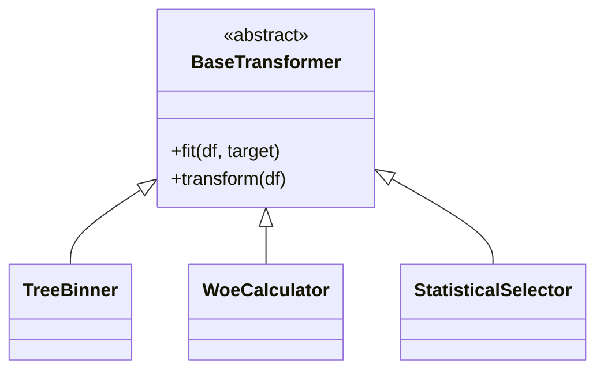

# 🚀 model-track-cr

[](https://pypi.org/project/model-track-cr/)
[](https://pypi.org/project/model-track-cr/)
[](https://opensource.org/licenses/MIT)

*Leia isso em outros idiomas: [English](README.md), [Português](README.pt-br.md)*

**model-track-cr** é uma biblioteca Python profissional projetada para **estruturar, padronizar e operacionalizar** todo o fluxo de modelagem estatística e de machine learning. 

Foi construída com foco em casos de uso de **crédito, risco e modelagem supervisionada** (Binária, Multiclasse e Regressão). Em vez de notebooks fragmentados, o `model-track-cr` fornece componentes coesos, orientados a Pandas, que trabalham juntos perfeitamente — desde o diagnóstico de dados até a implantação do modelo.

---

## 📦 Instalação

Instale via pip:

```bash
pip install model-track-cr
```

Para funcionalidades avançadas (como Otimização Bayesiana e suporte ao LightGBM):
```bash
pip install "model-track-cr[tuning]"
```

---

## ⚡ Quickstart

Veja como é fácil construir um pipeline completo de engenharia de features:

```python
import pandas as pd
from model_track.preprocessing import DataOptimizer
from model_track.binning import TreeBinner
from model_track.woe import WoeCalculator
from model_track.stats import StatisticalSelector

# 1. Otimizar memória
df = DataOptimizer.reduce_mem_usage(df)

# 2. Binning Supervisionado
binner = TreeBinner(max_depth=3)
binner.fit(df, column="feature", target="target")
df["feature_binned"] = binner.transform(df, column="feature")

# 3. Transformação Weight of Evidence (WoE)
woe_calc = WoeCalculator()
woe_calc.fit(df, target="target", columns=["feature_binned"])
df_woe = woe_calc.transform(df, columns=["feature_binned"])

# 4. Seleção de Features (Information Value & Cramer's V)
selector = StatisticalSelector(iv_threshold=0.02)
selector.fit(df_woe, target="target", features=["feature_binned"])
df_selected = selector.transform(df_woe)
```

---

## 🛠️ Principais Funcionalidades

- **📊 Diagnósticos & Otimização**: Redução de memória (`DataOptimizer`), auditoria de valores ausentes (`DataAuditor`) e extração de schema de dados.
- **🪜 Binning**: Estratégias de agrupamento Supervisionado (`TreeBinner`) e Não-Supervisionado (`QuantileBinner`).
- **🧮 WoE & IV**: Calculadoras de Weight of Evidence (`WoeCalculator`) e adaptadores de Information Value para tarefas Binárias, Multiclasse e Regressão.
- **🎯 Seleção de Features**: Seleção automatizada usando IV, Variância, Correlação de Spearman e V de Cramer (`StatisticalSelector`, `RegressionSelector`, `MulticlassSelector`).
- **📈 Monitoramento de Estabilidade**: Matrizes de estabilidade temporal de WoE e Population Stability Index (PSI) para rastrear data drift (`WoeStability`).
- **🧠 Tuning de Hiperparâmetros**: Otimização bayesiana agnóstica de modelo com presets integrados para LightGBM (`BayesianTuner`, `LGBMTuner`).
- **📏 Avaliação**: Métricas padronizadas e relatórios para todos os tipos de tarefas.
- **💾 Contexto do Projeto**: Serialize todo o seu pipeline (bins, mapas de WoE, metadados) para implantação em produção (`ProjectContext`).

---

## 📓 Notebooks de Exemplo

Quer ver em ação? Confira nossos exemplos ponta-a-ponta:

- [Pipeline Multiclasse (Wine Dataset)](notebooks/multiclass_example.ipynb): Binning → `MulticlassSelector` → `OvRWoeAdapter` → LightGBM → Avaliação.
- [Pipeline de Regressão (California Housing)](notebooks/regression_example.ipynb): Auditoria → `RegressionSelector` → LightGBM → Relatório de Estabilidade.

---

## 🧩 Arquitetura & Filosofia

A biblioteca é construída em torno da filosofia **Pandas-first**, onde cada componente segue a interface `fit`/`transform`, mas espera e retorna Pandas DataFrames. Isso garante que metadados (como nomes de colunas) sejam preservados em todo o pipeline.


```mermaid
classDiagram
    BaseTransformer <|-- TreeBinner
    BaseTransformer <|-- WoeCalculator
    BaseTransformer <|-- StatisticalSelector
    
    class BaseTransformer {
        <<abstract>>
        +fit(df, target)
        +transform(df)
    }
```

## 🤝 Contribuição
O projeto segue estritamente o **Test-Driven Development (TDD)** com 100% de cobertura. 
Veja [`CONTRIBUTING.md`](CONTRIBUTING.md) e [`AGENTS.md`](AGENTS.md) para configurações locais e diretrizes de Gitflow.

## 📄 Licença
Licença MIT
