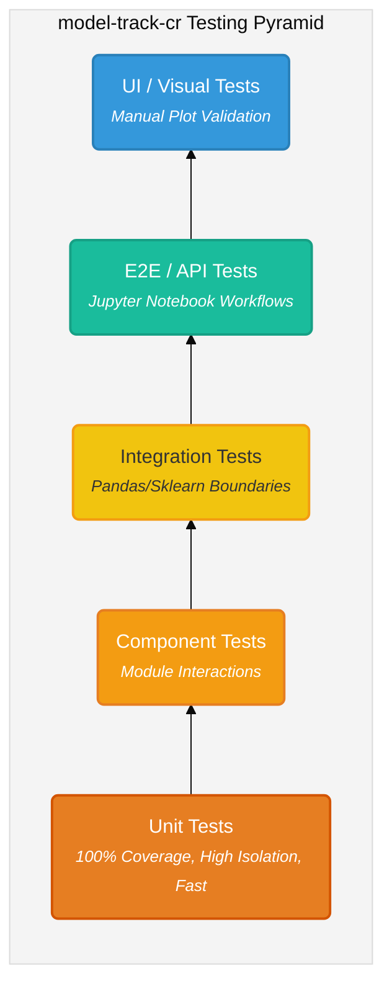
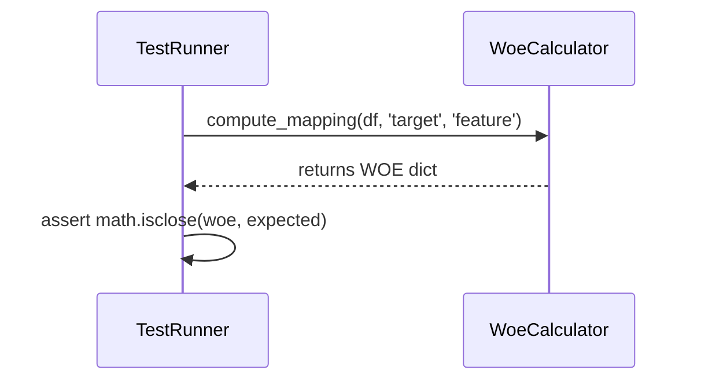
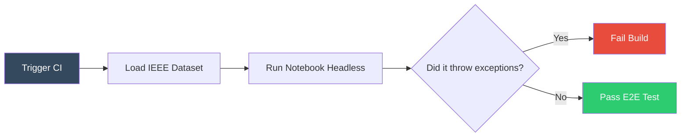

# Testing Strategy & Quality Standards

This document outlines the testing architecture for the `model-track-cr` project. As a professional data science and modeling library, ensuring accuracy, reproducibility, and stability is paramount. We achieve this by adhering to a **Testing Pyramid** methodology.

---

## 📐 The Testing Pyramid

Our testing strategy follows the classic pyramid model, adapted for a machine learning library context. The foundation consists of fast, highly isolated unit tests, building up to slower, more integrated, and closer-to-user workflows at the top.

> **Note**: As you move up the pyramid, tests become more integrated, slower to run, and closer to real-world usage. As you move down, tests are faster, highly isolated, and pinpoint exact logic failures.

---

## 🧱 1. Unit Tests (The Foundation)
**Current Status:** Fully Implemented (100% Code Coverage)

Unit tests isolate individual functions and mathematical computations to ensure core logic is flawless. 

- **Scope**: Mathematical calculations (Laplace smoothing), threshold conditions, individual private methods (e.g., `_count_row_inversions`).
- **Tooling**: `pytest` + `pytest-cov`.
- **Execution**: Runs in milliseconds.

## ⚙️ 2. Component Tests
**Current Status:** Planned

Component tests verify that multiple units within the same layer or namespace work together harmoniously without crossing external boundaries (like saving to disk or calling APIs).

- **Scope**: Verifying if `WoeStability` correctly orchestrates `WoeCalculator` and `CategoryMapper` internally.
- **Goal**: Ensure the "glue" code between internal classes works as expected before testing with massive external dataframes.

## 🔗 3. Integration Tests
**Current Status:** Planned

Integration tests validate the boundaries between `model-track-cr` and third-party ecosystems (Scikit-Learn, Pandas).

- **Scope**: 
  - Ensure transformers (`fit`, `transform`) behave perfectly when injected into a `sklearn.pipeline.Pipeline`.
  - Ensure Pandas `DataFrameGroupBy` warnings or memory optimizations do not break downstream logic.
- **Execution**: Can be run against synthetic, mid-sized datasets.

## 🚀 4. E2E / API Tests (Workflow Automation)
**Current Status:** Planned

End-to-End tests simulate the exact journey of a Data Scientist using the library.

- **Scope**: Automated execution of reference Jupyter Notebooks (e.g., `ieee_fraud_eda_baseline.ipynb`).
- **Goal**: Prevent breaking API changes. If a parameter name changes in the library, the notebook execution must fail in CI.
- **Tooling**: `nbconvert` or `pytest-ipynb` to run notebooks headlessly.

## 👁️ 5. UI / Visual & Manual Tests
**Current Status:** Ad-hoc / Manual

While we are a backend library, we provide critical visualizations (e.g., `ws.generate_view`). 

- **Scope**: Ensuring plots and charts render correctly, have legends, and are visually clear.
- **Goal**: Avoid visual regressions (e.g., colors disappearing, overlapping text).
- **Future Tooling**: Image comparison testing via `pytest-mpl` (matplotlib testing) or manual peer-review checklists for PRs touching visual components.

---

## 🛠️ Implementation Roadmap

Now that the pyramid is defined and our foundation (Unit Tests) is operating at **100% coverage**, our technical roadmap for QA involves:
1. Identifying critical paths for **Component Tests**.
2. Adding a Scikit-Learn pipeline **Integration Test** suite.
3. Setting up CI to run the `notebooks/` as **E2E Tests**.
