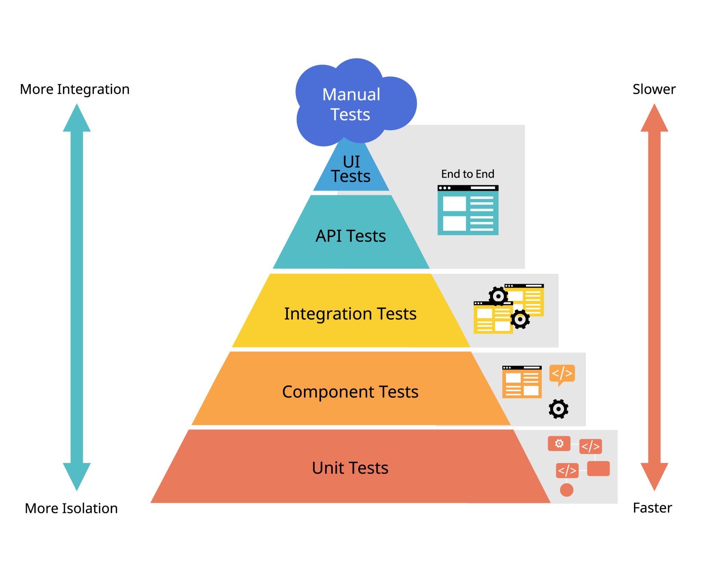

# Estratégia de Testes e Validação Estatística (v0.5.0)

*Read this in other languages: [English](TESTING_STRATEGY.md), [Português](TESTING_STRATEGY.pt-br.md)*

## 1. Filosofia de Testes
O `model_track_cr` adota uma abordagem de "Defesa em Profundidade". Não validamos apenas se o código "roda", mas se o resultado estatístico é matematicamente consistente, robusto a dados ruidosos e computacionalmente eficiente.

  

*Nossa pirâmide prioriza a base com testes unitários e reforça a confiança com validações estatísticas automatizadas.*

## 2. Estrutura de Testes (Mirror Strategy)
Para manter a escalabilidade, adotamos a **Estratégia de Espelho**, onde a pasta `tests/unit` reflete exatamente a estrutura de `src/model_track`.

- **`tests/unit/`**: Testes de caixa-preta para funções e métodos individuais. Foco em cobertura de linhas e tratamento de exceções.
- **`tests/statistical/`**: Testes de Propriedade (PBT). Validação de invariâncias matemáticas usando dados sintéticos.
- **`tests/integration/`**: Testes de fluxo completo (ex: do DataFrame bruto ao relatório de correlação).
- **`tests/benchmarks/`**: Monitoramento de performance e complexidade Big O.

## 3. Property-Based Testing (PBT)
Utilizamos a biblioteca `Hypothesis` para desafiar as implementações com dados que um humano raramente pensaria em codificar manualmente.

### Regras de Geração (Strategies):
- **DataFrames Extremos:** Geração de colunas com 100% de NaNs, valores constantes, e valores flutuantes próximos aos limites de precisão (`-1e6` a `1e6`).
- **Robustez de Tipos:** Testar misturas de tipos (float, int, category) para garantir que as classes (como analisadores ou tipadores) falhem graciosamente ou convertam corretamente.

## 4. Invariância e Sanidade Estatística
Toda métrica implementada deve passar por testes de sanidade:
- **Simetria:** $Corr(X, Y) == Corr(Y, X)$.
- **Limites Matemáticos:** Garantir que correlações estejam estritamente no intervalo $[-1, 1]$ e métricas como PSI/KS sejam sempre $\ge 0$.
- **Invariância de Escala:** Multiplicar uma coluna por uma constante não deve alterar o coeficiente de correlação de Pearson ou o valor de Information Value (IV).

## 5. Cobertura e Qualidade
- **Meta de Cobertura:** Mínimo de 95% para os módulos principais (operando atualmente a **100%**).
- **Tratamento de Erros:** Caminhos de falha (ex: arrays de tamanhos diferentes ou variância zero) devem ser testados explicitamente com `pytest.raises`.

## 6. Benchmarking de Performance (Big O)
Para evitar regressões de desempenho em grandes volumes de dados:
- **Baseline:** Medição para $N=10^3, 10^5, 10^6$ linhas.
- **Complexidade Alvo:** Operações de coluna única devem tender a $O(n)$. Matrizes de correlação e validações devem ser otimizadas via vetorização NumPy/Pandas para evitar loops $O(n^2)$ em Python puro.

## 7. Matriz de Compatibilidade
O CI/CD valida a biblioteca contra:
- **Python:** 3.10, 3.11, 3.12, 3.13.
- **Pandas:** v1.x e v2.x (suporte ao backend PyArrow).
